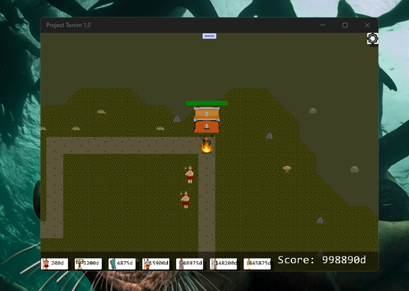

## ProjectTorrim v1.0 - master branch

R.E. of ProjectTorrim (Windows version of game). Planned as some "UWP remake".

## Scenario
Place down and manage your army to defend against the hoard of evil ones. They will stop at nothing to destroy you.

- Place down towers
- Fight through 32 waves of enemies
- Upgrade tower power
- Face off against 7 bosses
- Unlock new towers

Your army is seeking the entrance to hell itself but the gods do not want you to find it. As the expedition reaches closer, mythical legends are summoned to stop you with their hoards of corrupted creatures. Will you be able to beat them all?

## Screenshots

## Tech. details
- Published:	 Apr 19, 2021
- State: 	Released
- Platforms (original): Windows, Android
- Release date:	 Apr 19, 2021
- Rating: rated 4.5 out of 5 stars
- Author: Skeffles
- Janre: Strategy, Adventure
- Created with help: MonoGame, LMMS, Paint.net
- Tags:	2D, Fantasy, Management, myth, mythology, Singleplayer, Tower Defense
- Game session (approx.): About a half-hour
- Languages: English
- Game control: Mouse, Touchscreen
- Special things: One button
- UWP app : Min Win. SDK is 10240, Main Win. SDK is 19041  

## Status of UWP porting
- R.E. completed
- Init state  of UWP porting

## References
- https://skeffles.itch.io/ Skeffles (C# / Game developer)
- https://skeffles.itch.io/project-torrim Project Torrim (Tower Defence)
- https://www.youtube.com/watch?v=Lt7a13pFH8o&list=PLWxJt3IMAUPtIyPT9qNvq-v62Zm-jLV4G GameDev "video-backlog" (from skeffles)

## ToDo
- Fix game screen-scaling on any W10M-based flagman (Lumia 950 / 950XL) or hi-def UWP
- Improve touch control, add new swipes (main menu, gameplay)
- Fix game storage (score?)

## .
As is. No support. Educational purposes only. DIY.

## ..
[M][E] June, 8 2025